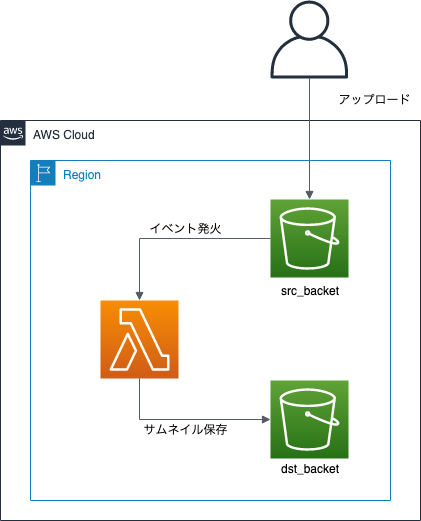

# S3に保存した画像のサムネイルを作成しよう

## 概要

このハンズオンでは、AWS Lambdaを初めて使う方向けに、
Amazon S3に保存した画像ファイルのサムネイル作成を、AWS Lambdaを使用して行います。

AWS LambdaはFaaS (Function as a Services) を提供してくれるサービスです。
AWS Lambdaを使用することで、サーバを意識することなく簡単なプログラムを実行することができます。

## 目的

このハンズオンでは、以下のことを行います。

- S3にバケットを作成する
- LambdaでPythonのプログラムを作成する
- LambdaにS3バケットアクセスするための権限を付与する
- トリガーを設定する
- サムネイル生成プログラムを作成する
- S3バケットに画像を保存して、サムネイル画像が生成されていることを確認する

## 全体図



## AWSマネジメントコンソールにアクセスする

1. [AWSのWebサイト](https://aws.amazon.com/jp/)にアクセスし、
    サイト右上にある「コンソールへログイン」をクリックします。
2. ログイン画面です。IAMユーザは「アカウント」には「アカウントID」を入れ、ユーザとパスワードにはIAMユーザのユーザ名とパスワードを入力します。
    ルートアカウントは、ユーザ名にルートアカウントのメールアドレスを入れ、パスワードにはルートアカウントのパスワードを入れます。
    必要事項を入力したら、「サインイン」をクリックします。
    - 多要素認証が有効な場合は、次の画面で認証トークンを入力します。
3. AWSマネジメントコンソールのトップページが開いたら完了です。

## 作業1: Amazon S3にバケットを作成する

まずは、S3にバケットを作成しましょう。
バケットは、元の画像を保存するバケットとサムネイル画像を保存するバケットの2種類作成します。

1. AWSマネジメントコンソールで「サービス」から「S3」をクリックします。
2. AWSマネジメントコンソールで右側に「東京」と表示されているか確認します。
    - 別のリージョン名が表示されていない場合は、リージョン名をクリックし「アジアパシフィック (東京)」を選択します。
3. 「バケットを作成」をクリックします。
    「バケット作成」ダイアログボックスが表示されます。
4. 「一般的な設定」ページで、以下のように設定します。
    - バケット名: jawsug-niigata-20240518-NUMBER-src
        - NUMBERを適当なランダムな番号に置き換えてください。
    - AWSリージョン: 「アジアパシフィック (東京) ap-northeast-1」になっているか確認ください
4. 他デフォルトのまま「バケットを作成」をクリックします。
    初期設定の状態でバケットを作成する事ができます。
    - "The requested bucket name is not available"で始まるエラーが表示された場合は、すでに同じバケット名が世の中に存在していることを示しています。最初の「Edit」リンクをクリックしてバケット名を変更して再度作成してください。

    S3バケット一覧には、先ほど作成したバケット名が表示されています。
    なお、初期設定ではオブジェクトはインターネットに公開されません。
5. 再度「バケットを作成」をクリックします。
    「バケット作成」ダイアログボックスが表示されます。
6. 「一般的な設定」ページで、以下のように設定します。
    - バケット名: jawsug-niigata-20240518-NUMBER-dst
        - NUMBERを適当なランダムな番号に置き換えてください。
    - AWSリージョン: 「アジアパシフィック (東京) ap-northeast-1」になっているか確認ください
7. 「バケットを作成」をクリックします。

これで、2種類のバケットを作成できました。

## 作業2: AWS LambdaでPythonのプログラムを作成する

次に、LambdaでPythonプログラムを作成します。
まずはPythonの関数を1つ作成して、テスト実行できるところまでやってみましょう。

1. AWSマネジメントコンソールで「サービス」から「Lambda」をクリックします。
2. AWSマネジメントコンソールで右側に「東京」と表示されているか確認します。
    - 別のリージョン名が表示されていない場合は、リージョン名をクリックし「アジアパシフィック (東京)」を選択します。
3. 「関数の作成」をクリックします。
4. 「一から作成」が選択されていることを確認し、
    以下の項目を入力して、「関数の作成」をクリックします。
    - 関数名:
        - createThumbnail
    - ランタイム:
        - 今回は「Python 3.11」を選択します。
    - 実行ロールの選択または作成をクリック
    - ロール:
        - 「基本的なLambdaアクセス権限で新しいロールを作成」が選択されていることを確認
        - これにより、Lambdaの実行ログをCloudWatch Logsに書き込む権限がある
            「createThumbnail-role-XXXXXXXXX」というIAMロールが作成されます。
5. 関数「createThumbnail」が作成できたら、とりあえず現状のままで動かしてみましょう。
    「テスト」をクリックします。
6. テストイベントの作成画面では、以下の項目を設定して「作成」をクリックします。
    - イベント名: myFirstLambdaTest
7. 再度「テスト」をクリックします。
    - 実行結果が「成功」になるはずです。

## 作業3: LambdaにS3バケットアクセスするための権限を付与する

ここまでくれば、あとは関数を修正すれば良いのですが、
その前に、LambdaからS3バケットへアクセスする必要があるので、
その権限を付与してあげます。

1. AWSマネジメントコンソールで「サービス」から「IAM」をクリックします。
2. 左側メニューにある「ロール」をクリックし、先ほど作成されたIAMロール
    「createThumbnail-role-XXXXXXXX」をクリックします。
3. 「許可」タブ内にある「許可ポリシー」の中にある
    「許可を追加」→「ポリシーをアタッチ」をクリックします。
4. 検索テキストボックスに「s3」と入力して、「AmazonS3FullAccess」のチェックボックスを選択し、
    「許可を追加」をクリックします。
5. ポリシー一覧に「AmazonS3FullAccess」が増えていることを確認します。
    - 今回はハンズオンなので全バケットに対してのフルアクセス権限を付与していますが、
        権限が必要なバケットを指定した方が本来は良いです。ここでは割愛します。
6. AWSマネジメントコンソールで「サービス」から「Lambda」をクリックします。
7. 関数一覧から「createThumbnail」をクリックします。
8. createThumbnailのページにある「設定」内にある「アクセス権限」の
    リソースの概要にあるサービスに「Amazon S3」が増えていればOKです。

これで、Lambda関数がAmazon S3にアクセスすることができるようになりました。

## 作業4: トリガーを設定する

トリガーとは、Lambda関数が起動するきっかけとなるイベントです。
今回は、srcバケットにオブジェクトが保存されたらLambda関数が起動するようにします。

1. createThumbnailのページにある「関数の概要」のダイアグラム内にある
    「トリガーを追加」をクリックします。
2. トリガーの設定では「S3」を選択し、以下の項目を入力して「追加」をクリックします。
    - バケット:
        - srcバケット「jawsug-niigata-20240518-NUMBER-src」
    - イベントタイプ:
        - すべてのオブジェクト生成イベント
    - プレフィックスとサフィックスは空のまま
    - 「再帰呼び出し」のチェックを入れる
        - Lambdaからトリガーバケットにファイル出力をしてしまうと、再帰呼び出しが無限に続くため、その場合Lambdaの費用が爆発的に増加してしまうので注意
3. 追加したら、「トリガー jawsug-niigata-20240518-NUMBER-src が関数 createThumbnail に正常に追加されました。」と
    表示されていればOKです。

## 作業5: サムネイル生成プログラムを作成する

srcバケットに画像が保存されたら、サムネイル画像をLambdaで生成し、
dstバケットにサムネイル画像を保存しましょう。
なお、今回はプログラムは書かずに、すでに用意されているファイルを使います。

1. 以下のリンクからファイルをダウンロードする。
    - [createThumb.zip](./src/createThumb.zip)
2. 関数コードの「コードソース」の「アップロード元」→「.zipファイル」をクリック
3. 「アップロード」をクリックし、先ほどダウンロードしたzipファイル(createThumb.zip)を選択
4. 「保存」をクリック

なお、今回のプログラムを実行するにあたって、以下の設定をしてください。
「設定」タブから行えます。

- 環境変数: 以下を追加してください。
    - キー: DST_BUCKET
    - 値: dstバケット名「jawsug-niigata-20240518-NUMBER-dst」
- 一般設定: 以下を変更してください。
    - メモリ: 512MB
    - タイムアウト: 10秒

設定変更後は改めて「保存」をクリックしてください。

### 補足: サムネイル生成プログラム

今回使用するプログラムは以下の通りです。
Python 3.11のランタイムで動作するLambda関数です。

```python
from PIL import Image
import boto3
import urllib.parse
import os
import json

DST_BUCKET = os.environ['DST_BUCKET']
MAX_WIDTH  = os.environ.get('MAX_WIDTH', 100)
MAX_HEIGHT = os.environ.get('MAX_HEIGHT', 100)

def lambda_handler(event, context):
    src_bucket = event['Records'][0]['s3']['bucket']['name']
    src_key = urllib.parse.unquote_plus(event['Records'][0]['s3']['object']['key'], encoding='utf-8')

    dst_bucket = DST_BUCKET
    splitext = os.path.splitext(src_key)
    dst_key = '{}_thumb{}'.format(splitext[0], splitext[1])

    tmp = '/tmp/' + os.path.basename(src_key)

    s3 = boto3.client('s3')
    try:
        s3.download_file(Bucket=src_bucket, Key=src_key, Filename=tmp)
        img = Image.open(tmp)
        img.thumbnail((MAX_WIDTH, MAX_HEIGHT), Image.LANCZOS)
        img.save(tmp)
        s3.upload_file(Filename=tmp, Bucket=dst_bucket, Key=dst_key)
        ret = {
            'statusCode': 200,
            'body': json.dumps({'message': 'create thumbnail: {0}/{1}'.format(dst_bucket, dst_key)})
        }
        return ret
    except Exception as e:
        print(e)
        raise e
```

## 作業6: S3バケットに画像を保存して、サムネイル画像が生成されていることを確認する

Lambda関数を定義したので、実際にS3バケットに画像を保存して、
別のバケットにサムネイル画像が生成されていることを確認しましょう。

1. AWSマネジメントコンソールで「サービス」から「S3」をクリックします。
2. バケット名一覧からsrcバケット「jawsug-niigata-20240518-NUMBER-src」をクリックします。
3. 「アップロード」をクリックします。
4. 「ファイルを追加」をクリックし、画像ファイルを選択します。
    - 画像ファイルは[こちら](./images/ramen.jpg)からダウンロードして使用していただいて構いません。
    - jpgファイル、もしくは、pngファイルだと動作すると思います。
5. 「アップロード」をクリックします。
    - バケットに画像ファイルがアップロードできればOKです。
6. バケット一覧に戻り、dstバケット「jawsug-niigata-20240518-NUMBER-dst」をクリックします。
7. バケットに画像ファイルがあれば、OKです。
    - 表示されない場合は、ブラウザをリロードしてみましょう。

以上です。
お疲れ様でした。

---

## 補足: Pythonのデプロイパッケージ作成

詳しくは、[Python の AWS Lambda デプロイパッケージ](https://docs.aws.amazon.com/ja_jp/lambda/latest/dg/lambda-python-how-to-create-deployment-package.html)に掲載されています。

今回は、Pythonの画像処理ライブラリである「Pillow」を使用して、
サムネイル画像を生成しています。

PillowはOS依存でビルドされるパッケージであるため、
Lambda関数のランタイムに合わせてビルドする必要があります。
今回はAmazon Linux2のAMIを使用したEC2インスタンスを作成し、
そこでPython仮想環境を作成した上でPillowをインストールしています。

### 1. EC2上でPythonインストール

```bash
sudo yum install python3 python3-devel python3-libs python3-setuptools
python3 --version
```

### 2. EC2上でPillowライブラリをzip化

```bash
python3 -m venv env
source env/bin/activate
pip install Pillow
cd env/lib64/python3.11/site-packages/
zip -r9 ${OLDPWD}/function.zip .
```

### 3. lambda_function.pyをzip内に格納

```bash
cp function.zip createThumb.zip
zip -g createThumb.zip lambda_function.py
```

## 補足: Node.jsのデプロイパッケージ作成

Node.jsの場合は「node_modules」ディレクトリごとzipファイルにしておく必要があります。

詳しくは、[Node.js の AWS Lambda デプロイパッケージ](https://docs.aws.amazon.com/ja_jp/lambda/latest/dg/nodejs-create-deployment-pkg.html)をご確認ください。
