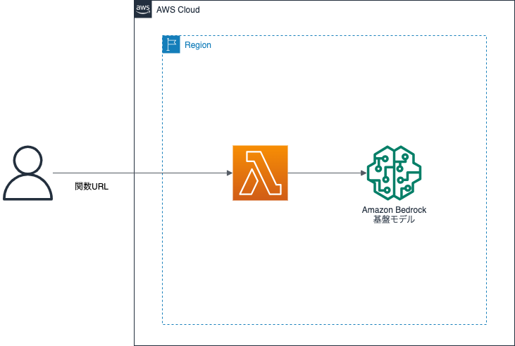
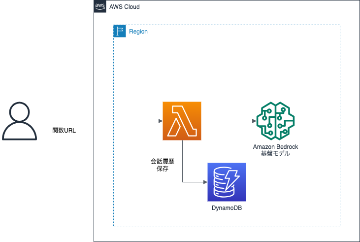
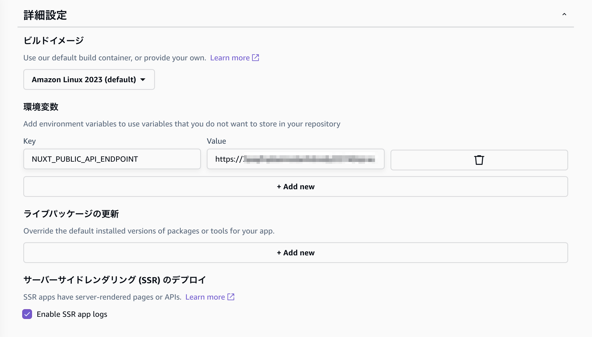

# 生成AIチャットアプリを作成しよう

## 概要

このハンズオンでは、AWS Lambdaを初めて使う方向けに、
Amazon Bedrockで利用できる生成AIモデルを用いて、簡単な生成AIチャットの機能をAWS Lambdaを使用して行います。

AWS LambdaはFaaS (Function as a Services) を提供してくれるサービスです。
AWS Lambdaを使用することで、サーバを意識することなく簡単なプログラムを実行することができます。

## 目的

このハンズオンでは、以下のことを行います。

- Bedrock基盤モデルアクセスを申請する
- LambdaでPythonのプログラムを作成する
- Lambda関数URLを有効化する
- Lambda Layerを使ってPythonライブラリを導入する
- 動作を確認する
- \[オプション\] Amazon DynamoDBを使って会話履歴を保存する

## 全体図



## AWSマネジメントコンソールにアクセスする

1. [AWSのWebサイト](https://aws.amazon.com/jp/)にアクセスし、
    サイト右上にある「コンソールへログイン」をクリックします。
2. ログイン画面です。IAMユーザは「アカウント」には「アカウントID」を入れ、ユーザとパスワードにはIAMユーザのユーザ名とパスワードを入力します。
    ルートアカウントは、ユーザ名にルートアカウントのメールアドレスを入れ、パスワードにはルートアカウントのパスワードを入れます。
    必要事項を入力したら、「サインイン」をクリックします。
    - 多要素認証が有効な場合は、次の画面で認証トークンを入力します。
3. AWSマネジメントコンソールのトップページが開いたら完了です。

## Bedrockモデルアクセスの有効化

今回は東京リージョンにて、Bedrock基盤モデルの利用申請をします。

1. AWSマネジメントコンソールで「サービス」から「Amazon Bedrock」をクリックします。
2. AWSマネジメントコンソールで右側に「東京」と表示されているか確認します。
    - 別のリージョン名が表示されていない場合は、リージョン名をクリックし「アジアパシフィック (東京)」を選択します。
3. 左側メニューから「モデルアクセス」をクリックします。
    - 左側メニュー非表示の場合、左側上にある「3本線」のアイコンをクリックして表示しましょう。
3. 「モデルアクセスを管理」をクリックします。
4. 「Anthropic」の「Claude」にチェックを入れて、「変更を保存」をクリック
    - Claudeのモデルをまだ使ったことがない方は先に「ユースケースの詳細」を送信する必要があります
        - 参考: [参考: Amazon Bedrock をマネジメントコンソールからちょっと触ってみたいときは Base Models（基盤モデル）へのアクセスを設定しましょう | DevelopersIO](https://dev.classmethod.jp/articles/if-you-want-to-try-out-amazon-bedrock-from-the-management-console-you-can-set-up-access-to-base-models/)
        - 参考: [Amazon BedrockのIAMポリシーとユースケースの詳細を申告してからチャットを試すまで #AWS - Qiita](https://qiita.com/mkin/items/2f60566d15777557d533#%E3%83%A6%E3%83%BC%E3%82%B9%E3%82%B1%E3%83%BC%E3%82%B9%E3%81%AE%E8%A9%B3%E7%B4%B0%E3%82%92%E9%80%81%E4%BF%A1)
5. アクセスが付与される間に、以降の作業を進めます。

## Lambda関数の作成

1. AWSマネジメントコンソールで「サービス」から「Lambda」をクリックします。
2. AWSマネジメントコンソールで右側に「東京」と表示されているか確認します。
    - 別のリージョン名が表示されていない場合は、リージョン名をクリックし「アジアパシフィック (東京)」を選択します。
3. 「関数の作成」をクリックします。
4. 「一から作成」が選択されていることを確認し、
    以下の項目を入力して、「関数の作成」をクリックします。
    - 関数名:
        - chatBedrock
    - ランタイム:
        - 今回は「Python 3.12」を選択します。
    - 実行ロールの選択または作成をクリック
    - ロール:
        - 「基本的なLambdaアクセス権限で新しいロールを作成」が選択されていることを確認
        - これにより、Lambdaの実行ログをCloudWatch Logsに書き込む権限がある
            「chatBedrock-role-XXXXXXXXX」というIAMロールが作成されます。
5. 関数「chatBedrock」が作成できたら、とりあえず現状のままで動かしてみましょう。
    「テスト」をクリックします。
6. テストイベントの作成画面では、以下の項目を設定して「作成」をクリックします。
    - イベント名: myFirstLambdaTest
7. 再度「テスト」をクリックします。
    - 実行結果が「成功」になるはずです。

## Lambda 関数 URL の利用

今回はトリガーとして、Lambda関数URLをコールすることでLambda関数を呼び出したいと思います。

1. chatBedrockのページにある「設定」をクリックし、左側メニューの「関数 URL」をクリックします。
2. 「関数 URL を作成」をクリックします。
3. 以下の設定を行い、「保存」をクリックします。
    - 認証タイプ: NONE
    - 今回のハンズオンでは簡略化のため、認証タイプをNONEにすることで関数URLさえ知っていれば誰からでもアクセス可能になります。
4. 関数URLが生成されていると思うので、これをクリックします。
    - 普通にクリックすると、JSON文字列が表示されると思います。
    - 認証タイプを「AWS_IAM」のままにしていると、今回は `{"Message":"Forbidden"}` と表示されると思います
        - 認証タイプが「AWS_IAM」の場合、IAM認証 (IAMロールやcurlでSignatureV4アクセス等) が無ければアクセス拒否されます

### [補足] 認証タイプが「AWS_IAM」の場合の、curlでのアクセス方法 (IAMのAPIキー払い出している方限定)

認証タイプが「AWS_IAM」の場合、例えばcurlからアクセスする際は `--aws-sigv4` オプションを使って以下のようにすると、アクセス可能です。

```bash
curl -X GET "<Lambda関数URL>" \
    -H "Content-Type: application/json" \
    --aws-sigv4 "aws:amz:ap-northeast-1:lambda" \
    --user "${AWS_ACCESS_KEY_ID}:${AWS_SECRET_ACCESS_KEY}"
```

## Bedrockモデルの利用

1. AWSマネジメントコンソールで「サービス」から「Amazon Bedrock」をクリックします。
2. AWSマネジメントコンソールで右側に「東京」と表示されているか確認します。
    - 別のリージョン名が表示されていない場合は、リージョン名をクリックし「アジアパシフィック (東京)」を選択します。
3. 左側メニューから「基盤モデル」の「ベースモデル」をクリックします。
    - 左側メニュー非表示の場合、左側上にある「3本線」のアイコンをクリックして表示しましょう。
4. Claude v2.1 のリンクをクリックします。
5. ページ下部のAPIリクエストにある `"modelId"` の値をコピーしておきます。

ちなみに、「プレイグラウンドで開く」をクリックすると、マネジメントコンソール上で基盤モデルの動作確認が可能です。

## LambdaにBedrockモデルへアクセスするための権限を付与する

LambdaからBedrockモデルへアクセスする必要があるので、
その権限を付与してあげます。

1. AWSマネジメントコンソールで「サービス」から「IAM」をクリックします。
2. 左側メニューにある「ロール」をクリックし、先ほど作成されたIAMロール
    「chatBedrock-role-XXXXXXXX」をクリックします。
3. 「許可」タブ内にある「許可ポリシー」の中にある
    「許可を追加」→「ポリシーをアタッチ」をクリックします。
4. 検索テキストボックスに「bedrock」と入力して、「AmazonBedrockFullAccess」のチェックボックスを選択し、
    「許可を追加」をクリックします。
5. ポリシー一覧に「AmazonBedrockFullAccess」が増えていることを確認します。
    - 今回はハンズオンなので全バケットに対してのフルアクセス権限を付与していますが、
        権限が必要なバケットを指定した方が本来は良いです。ここでは割愛します。
6. AWSマネジメントコンソールで「サービス」から「Lambda」をクリックします。
7. 関数一覧から「chatBedrock」をクリックします。
8. chatBedrockのページにある「設定」内にある「アクセス権限」の
    リソースの概要にあるサービスに「Amazon Bedrock」が増えていればOKです。

これで、Lambda関数がAmazon Bedrockにアクセスすることができるようになりました。

## Lambda Layerを使って外部ライブラリを導入する

ハンズオン1では、Lambda関数とライブラリをまとめてzipパッケージ化してアップロードすることで対応しました。
今回は、ライブラリをLambda Layerを使って導入していきます。
今回使用するライブラリ (LangChain) は、ファイルアップロードだと容量が大きいため、
一旦S3バケットにLayerファイルをアップロードして登録するようにします。

1. 以下のリンクから、Lambda Layerファイルをダウンロードします。
    - [langchain-py312-layer.zip](./src/chatBedrock/langchain-py312-layer.zip)
2. AWSマネジメントコンソールで「サービス」から「S3」をクリックします。
3. AWSマネジメントコンソールで右側に「東京」と表示されているか確認します。
    - 別のリージョン名が表示されていない場合は、リージョン名をクリックし「アジアパシフィック (東京)」を選択します。
4. バケット名一覧から、ハンズオン1で作成した、以下の dst バケットをクリックします。
    - 「jawsug-niigata-20240518-NUMBER-dst」
    - hostingのバケットでもOKですが、srcのバケットはハンズオン1のLambdaが起動してエラーになるので、srcバケットへのアップロードはやめておきましょう。
    - 本来ならばデプロイ用バケットを別途用意することをオススメしますが、今回のハンズオンではすでに作成しているバケットを流用しています。
5. 「アップロード」をクリックします。
6. 「ファイルを追加」をクリックし、「langchain-py312-layer.zip」を選択します。
7. 「アップロード」をクリックします。
8. 一覧にアップロードした「langchain-py312-layer.zip」ファイルが掲載されていればOKです。
9. AWSマネジメントコンソールで「サービス」から「Lambda」をクリックします。
10. AWSマネジメントコンソールで右側に「東京」と表示されているか確認します。
    - 別のリージョン名が表示されていない場合は、リージョン名をクリックし「アジアパシフィック (東京)」を選択します。
11. 左側メニューより「レイヤー」をクリックします。
    - 左側メニュー非表示の場合、左側上にある「3本線」のアイコンをクリックして表示しましょう。
12. 「レイヤーの作成」をクリックします
13. 以下の項目を入力して、「作成」をクリックします。
    - 名前: langchain-py312-layer
    - 「Amazon S3からファイルをアップロードする」を選択
    - Amazon S3 のリンクURL: 以下のようにします。
        - `s3://jawsug-niigata-20240518-NUMBER-dst/langchain-py312-layer.zip`
    - 互換性のあるアーキテクチャ: 「x86_64」を選択
    - 互換性のあるランタイム: 「Python 3.12」を選択
14. Lambda Layerが追加されたことを確認します。
    - レイヤー名とバージョンをメモしておきます。

Lambda Layerが追加されたら、Lambda関数にLayerをアタッチします。

1. 左側メニューより「関数」をクリックします。
    - 左側メニュー非表示の場合、左側上にある「3本線」のアイコンをクリックして表示しましょう。
2. 関数の一覧の中から「chatBedrock」をクリックします。
3. コードタブの中から「レイヤー」の「レイヤーの追加」をクリックします。
4. 以下の設定をして「追加」をクリックします。
    - レイヤーソース: カスタムレイヤー
    - カスタムレイヤー: 作成した「Langchain-py312-layer」を選択
    - バージョン: メモしたバージョン番号を選択
        - 番号が大きいものが最新版となるので、今回は更新してない限り「1」のみ選択となるはず
5. Lambda関数にLambda LayerがアタッチされればOKです。

## 関数の実装

今回のプログラムを実行するにあたって、以下の設定をしてください。
「設定」タブから行えます。

- 一般設定: 以下を変更してください。
    - メモリ: 512MB
    - タイムアウト: 30秒

コードは以下の通り:

```python
from langchain_aws import ChatBedrock
from langchain_core.messages import HumanMessage
import json

## using Bedrock Chat model
chat = ChatBedrock(
    model_id="anthropic.claude-v2:1",  ## 先ほどコピーした modelId の値をセットします
    model_kwargs={
        "max_tokens": 1000,
        "temperature": 0.5,
    },
)

def lambda_handler(event, context):
    # for debug
    print(f"Received event: {json.dumps(event, ensure_ascii=False)}")

    param = event.get('queryStringParameters')
    if param:
        input_text = param.get("input_text")
    else:
        input_text = event.get("input_text")
    output_text = chat_conversation(input_text)

    return {
        "output_text": output_text,
    }

def chat_conversation(input_text:str) -> str:
    messages = [
        HumanMessage(
            content=input_text
        ),
    ]

    result = chat.invoke(messages)
    # for debug
    print(f"Result: {result}")

    output_text = result.content
    return output_text
```

「Test」の右側の下三角アイコンをクリックし、「Configure test event」をクリック
イベントJSONを以下のように変更して「保存」をクリック

```json
{
  "input_text": "おはようございます。今日の新潟の天気はどうですか？"
}
```

「Test」を実行してテスト実行をすると、何かしらの応答があればOKです。

関数URLから実行する場合は以下のようにします。

```
https://<Lambda関数URLのドメイン>/?input_text=おはようございます。今日の新潟の天気はどうですか？
```

---

以降は時間があればやってみてください。

## オプション: 会話履歴を記憶・保存できるように変更

### 全体図




### DynamoDB設定

1. AWSマネジメントコンソールで「サービス」から「DynamoDB」をクリックします。
2. 左側メニューにある「テーブル」をクリックし、「テーブルの作成」をクリックします。
3. 以下の設定を行い「テーブルの作成」をクリックします。
    - テーブル名: ChatMessageHistory
    - パーティションキー:
        - キー名: SessionId
        - タイプ: 文字列
4. 状態が「アクティブ」になるまで、しばらく待ちます
    - テーブルが正常に作成されればOKです

### DynamoDBへのアクセス権限付与

1. AWSマネジメントコンソールで「サービス」から「IAM」をクリックします。
2. 左側メニューにある「ロール」をクリックし、先ほど作成されたIAMロール
    「chatBedrock-role-XXXXXXXX」をクリックします。
3. 「許可」タブ内にある「許可ポリシー」の中にある
    「許可を追加」→「ポリシーをアタッチ」をクリックします。
4. 検索テキストボックスに「dynamo」と入力して、「AmazonDynamoDBFullAccess」のチェックボックスを選択し、
    「許可を追加」をクリックします。
5. ポリシー一覧に「AmazonDynamoDBFullAccess」が増えていることを確認します。
    - 今回はハンズオンなので全バケットに対してのフルアクセス権限を付与していますが、
        権限が必要なバケットを指定した方が本来は良いです。ここでは割愛します。
6. AWSマネジメントコンソールで「サービス」から「Lambda」をクリックします。
7. 関数一覧から「chatBedrock」をクリックします。
8. chatBedrockのページにある「設定」内にある「アクセス権限」の
    リソースの概要にあるサービスに「Amazon DynamoDB」が増えていればOKです。

これで、Lambda関数がAmazon DynamoDBにアクセスすることができるようになりました。

### コード

```python
from langchain_aws import ChatBedrock
from langchain_core.messages import HumanMessage
from langchain.chains import ConversationChain  ## 追加
from langchain.memory import ConversationBufferMemory  ## 追加
from langchain_community.chat_message_histories import DynamoDBChatMessageHistory  ## 追加
import json
import uuid  ## 追加

## using Bedrock Chat model
chat = ChatBedrock(
    model_id="anthropic.claude-v2:1",
    model_kwargs={
        "max_tokens": 1000,
        "temperature": 0.5,
    },
)

def lambda_handler(event, context):
    # for debug
    print(f"Received event: {json.dumps(event, ensure_ascii=False)}")

    param = event.get('queryStringParameters')
    if param:
        input_text = param.get("input_text")
        session_id = param.get("session_id")
    else:
        input_text = event.get("input_text")
        session_id = event.get("session_id")
    if (session_id is None) or (session_id == ''):
        session_id = str(uuid.uuid4())

    output_text = chat_conversation(session_id, input_text)

    return {
        "session_id": session_id,
        "output_text": output_text,
    }

def chat_conversation(session_id:str, input_text:str) -> str:
    ## DynamoDBに会話履歴内容を保存して永続化 (Historyモジュール)
    history = DynamoDBChatMessageHistory(
        table_name="ChatMessageHistory",
        session_id=session_id,
    )

    ## 会話履歴を記憶 (Memoryモジュール)
    memory = ConversationBufferMemory(
        chat_memory=history,
        return_messages=True,
    )

    ## 複数モジュールを組み合わせて処理 (Chainモジュール)
    chain = ConversationChain(
        llm=chat,
        memory=memory,
        verbose=True,
    )

    ## 入力プロンプト
    messages = [
        HumanMessage(
            content=input_text
        ),
    ]

    result = chain.invoke(messages)
    # for debug
    print(f"Result: {result}")

    output_text = result.get("response")
    return output_text
```

会話の続きがしたい場合は、入力にセッションIDを付与する必要があります。
「Test」の右側の下三角アイコンをクリックし、「Configure test event」をクリック
イベントJSONを以下のように変更して「保存」をクリック

```json
{
  "session_id": "<セッションID文字列>",
  "input_text": "おはようございます。今日の新潟の天気はどうですか？"
}
```

関数URLから実行する場合は以下のようにします。

```
https://<Lambda関数URLのドメイン>/?session_id=<セッションID文字列>&input_text=おはようございます。今日の新潟の天気はどうですか？
```

以上です。お疲れ様でした。

---

## 補足: 東京リージョンのLambdaからオレゴンリージョンのBedrockのClaude v3を使いたい場合

以下のようにリージョン名とモデルIDを指定すれば良いです。
なお、事前にオレゴンリージョンでモデルアクセスの申請を済ませておく必要があります。

```python
## using Bedrock Chat model
chat = ChatBedrock(
    region_name="us-west-2",
    model_id="anthropic.claude-3-haiku-20240307-v1:0",
    model_kwargs={
        "max_tokens": 1000,
        "temperature": 0.5,
    },
)
```

---

## フロントエンドから呼び出したい場合

フロントエンドとして、AWS Amplifyホスティングで動作するNuxtアプリから関数URLを呼び出してみます。

(時間があるときに試してみましょう)

### Lambda関数URLにCORS設定

1. 関数URLの編集時に「その他の設定」にて「オリジン間リソース共有 (CORS) を設定」にチェックをいれる
2. 以下の項目を設定する
    - 許可オリジン: `*`
    - 許可ヘッダー: `*`
    - 許可メソッド: `*`

今回のハンズオンでは、細かいCORSの設定を無視してます。

### プロントエンドアプリのリポジトリを、自身のGitHubアカウント内にフォーク

- 以下のリポジトリをフォークします
    - https://github.com/kasacchiful/jawsug-niigata-20240518-lambda-handson-chat-ui/

### Amplifyホスティングにデプロイ

1. Amplifyを開き「新しいアプリを作成」をクリックします
2. 「GitHub」を選択して「次へ」をクリックします
3. フォークしたリポジトリを選択し、ブランチを「main」にして「次へ」をクリックします
4. 「詳細設定」をクリックし、以下の設定をして「次へ」をクリックします
    - 環境変数
        - キー: `NUXT_PUBLIC_API_ENDPOINT`
        - 値: Lambda関数URL ( `https://` から入れる)
    - 「Enable SSR app logs」にチェック
5. 「保存してデプロイ」をクリック
6. デプロイ完了後、作成されたドメインにアクセスしてみてください




なお、このアプリはセッションIDを考慮していません。
セッションIDを考慮したアプリにぜひ改修してみてください。

