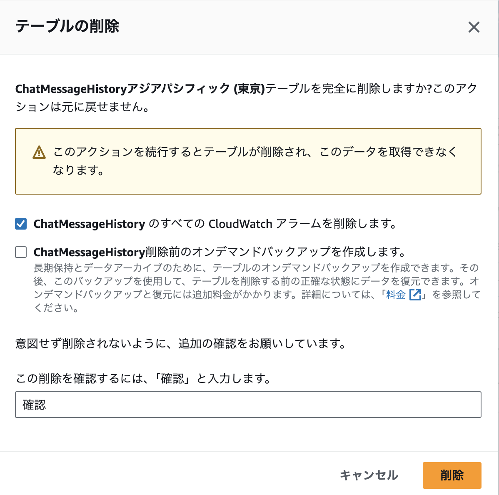
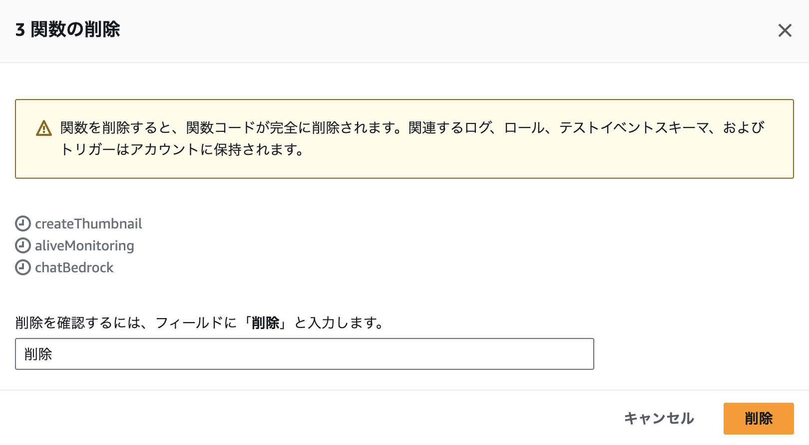
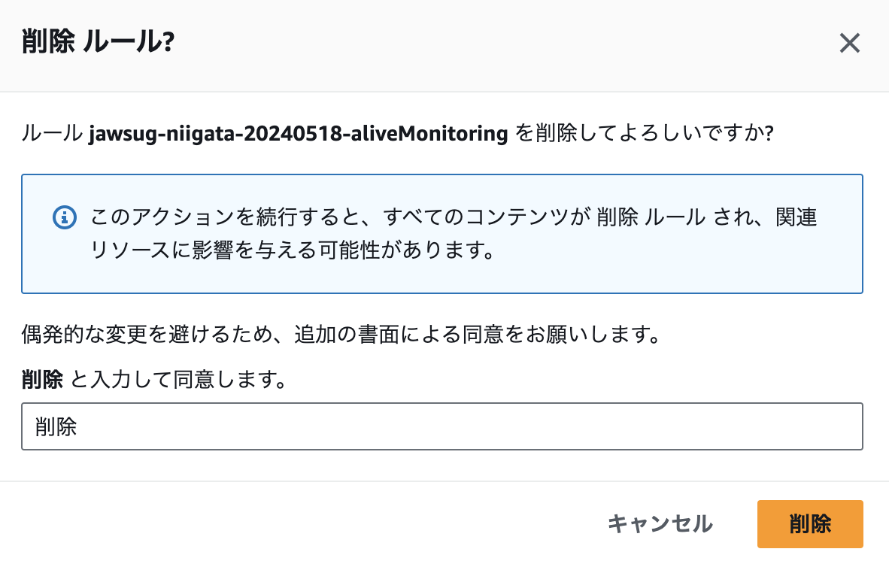
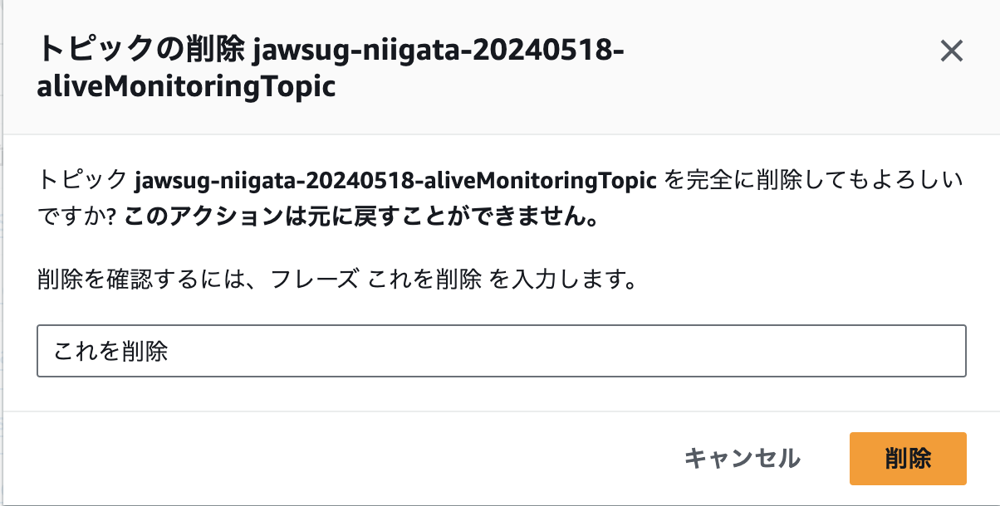
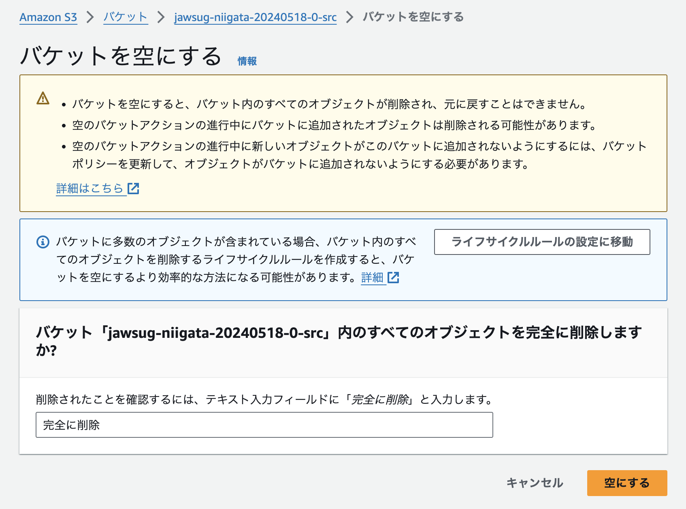
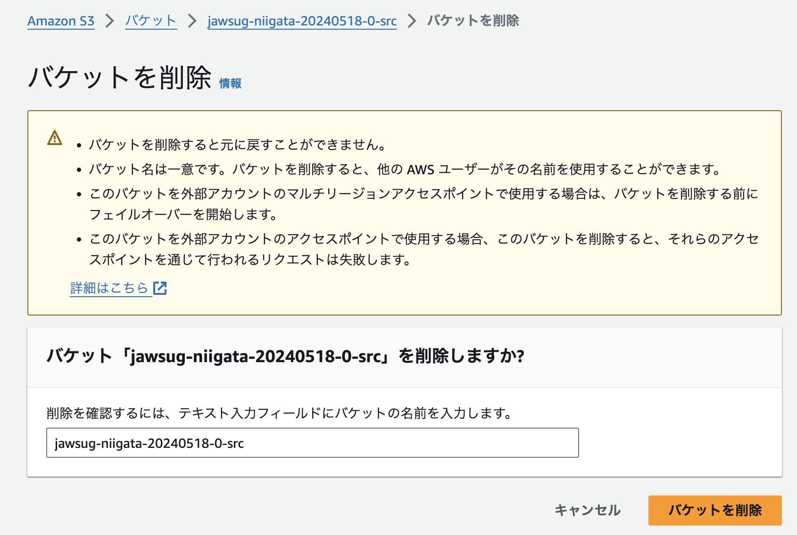
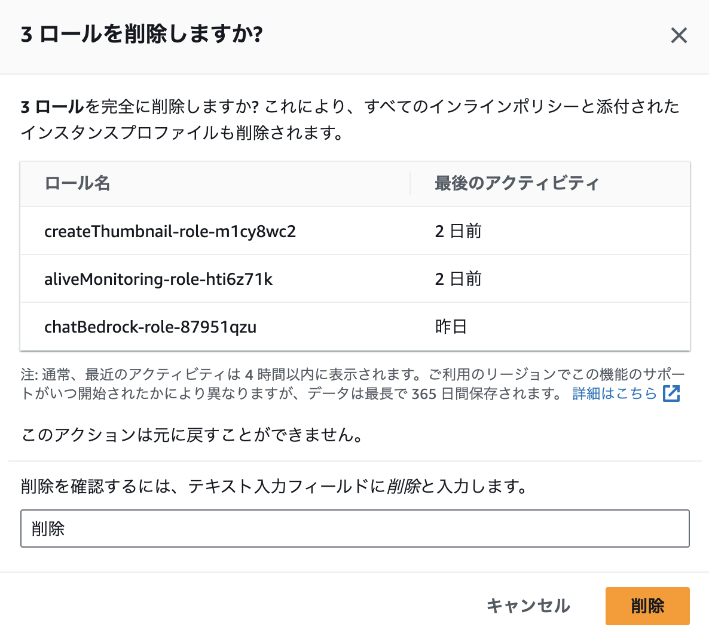
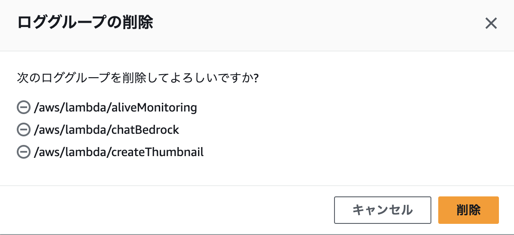

# 後片付け

最後に、各種AWSリソースを削除して後片付けをしましょう。

## [オプション] DynamoDBテーブルの削除

今回作成したDynamoDBテーブル「ChatMessageHistory」を削除します

1. AWSマネジメントコンソールで「サービス」から「DynamoDB」をクリックします。
2. 今回作成した「ChatMessageHistory」テーブルの左側にチェックを入れ「削除」をクリックします
3. 「確認」と入力し、「削除」をクリックします。

## Lambda関数の削除

今回のハンズオンで作成した以下のLambda関数を削除します。

- createThumbnail
- aliveMonitoring
- chatBedrock

1. AWSマネジメントコンソールで「サービス」から「Lambda」をクリックします。
2. 左側メニューから「関数」をクリックし、今回作成したLambda関数の左側にチェックを入れ、「アクション」→「削除」をクリックします。
3. 「削除」と入力し、「削除」をクリックします。
4. 成功したら「閉じる」をクリックします。

## Lambda Layerの削除

今回のハンズオンで使用した以下のLambda Layerを削除します。

- langchain-py312-layer

1. AWSマネジメントコンソールで「サービス」から「Lambda」をクリックします。
2. 左側メニューから「レイヤー」をクリックし、今回作成したLambda Layerをクリックします。
3. 「削除」をクリックします。
4. ポップアップが表示されるので、「削除」をクリックします。

なお、複数バージョンが作成されているレイヤーは全てのバージョンが削除されるまで繰り返し削除を実行してください。

## EventBridgeルールの削除

今回のハンズオンのトリガーとして生成された以下のEventBridgeルールを削除します。

- jawsug-niigata-20240518-aliveMonitoring

1. AWSマネジメントコンソールで「サービス」から「Amazon EventBridge」をクリックします。
2. 左側メニューから「ルール」をクリックし、今回作成したEventBridgeルールの左側にチェックを入れ、「削除」をクリックします。
3. 「削除」と入力し、「削除」をクリックします。

## SNSトピックの削除

今回のハンズオンで作成した以下のSNSトピックを削除します。

- jawsug-niigata-20240518-aliveMonitoringTopic

1. AWSマネジメントコンソールで「サービス」から「Simple Notification Service」をクリックします。
2. 左側メニューから「トピック」をクリックし、今回作成したSNSトピックの左側にチェックを入れ、「削除」をクリックします。
3. 「これを削除」と入力し、「削除」をクリックします。

## S3バケットの削除

今回のハンズオンで作成した以下のS3バケットを削除します。

- jawsug-niigata-20240518-NUMBER-src
- jawsug-niigata-20240518-NUMBER-dst
- jawsug-niigata-20240518-NUMBER-hosting

ちなみに、S3バケットを削除する際は、あらかじめバケットの中身を空にする必要があります。

1. AWSマネジメントコンソールで「サービス」から「S3」をクリックします。
2. 左側メニューから「バケット」をクリックし、今回作成したS3バケット1つの左側にチェックを入れ、「空にする」をクリックします。
3. 「完全に削除」と入力し、「空にする」をクリックします。
4. S3オブジェクトが全て削除されたら「終了」をクリックします。

5. 再度同じS3バケットの左側にチェックを入れ、「削除」をクリックします。
6. バケット名を入力し、「バケットを削除」をクリックします。
7. バケットが正常に削除されたことを確認します。

残りのバケットも同様に「空にする」「削除」をお願いします。

## IAMロールの削除

今回Lambda関数作成時に自動生成された以下のIAMロールを削除します。

- createThumbnail-role-XXXXXXXXX
- aliveMonitoring-role-XXXXXXXXX
- chatBedrock-role-XXXXXXXXX

1. AWSマネジメントコンソールで「サービス」から「IAM」をクリックします。
2. 左側メニューから「ロール」をクリックし、今回生成されたIAMロールの左側にチェックを入れ、「削除」をクリックします。
3. 「削除」を入力し、「削除」をクリックします。

## CloudWatch Logs ロググループの削除

今回Lambda関数作成時に自動生成された以下のCloudWatch Logsのロググループを削除します。

- /aws/lambda/createThumbnail
- /aws/lambda/aliveMonitoring
- /aws/lambda/chatBedrock

1. AWSマネジメントコンソールで「サービス」から「CloudWatch」をクリックします。
2. 左側メニューから「ロググループ」をクリックし、今回生成されたロググループの左側にチェックを入れ、「アクション」→「ロググループの削除」をクリックします。
3. 「削除」をクリックします。

以上です。お疲れ様でした。

---

## 補足

- Bedrockはこのままにします
    - 何もアクセスしなければ費用はかかりません
